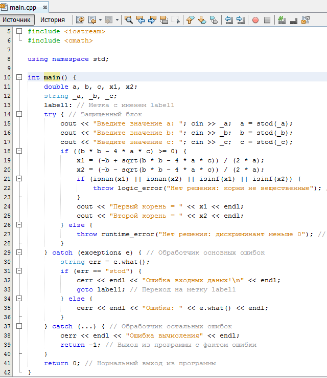

# CPP_QuadraticEquation
Расширенный пример решения квадратного уравнения на C++ в NetBeans




# Код программы:

```
/*
 * Пример решения квадратного уравнения
 */

#include <iostream>
#include <cmath>

using namespace std;

int main() {
    double a, b, c, x1, x2;
    string _a, _b, _c;
    label1: // Метка с именем label1
    try { // Защищенный блок
        cout << "Введите значение a: "; cin >> _a;  a = stod(_a);
        cout << "Введите значение b: "; cin >> _b;  b = stod(_b);
        cout << "Введите значение c: "; cin >> _c;  c = stod(_c);
        if ((b * b - 4 * a * c) >= 0) {
            x1 = (-b + sqrt(b * b - 4 * a * c)) / (2 * a);
            x2 = (-b - sqrt(b * b - 4 * a * c)) / (2 * a);
            if (isnan(x1) || isnan(x2) || isinf(x1) || isinf(x2)) {
                throw logic_error("Нет решения: корни не вещественные"); // Генерируем ошибку
            }
            cout << "Первый корень = " << x1 << endl;
            cout << "Второй корень = " << x2 << endl;
        } else {
            throw runtime_error("Нет решения: дискриминант меньше 0"); // Генерируем ошибку
        }
    } catch (exception& e) { // Обработчик основных ошибок
        string err = e.what();
        if (err == "stod") {
            cerr << endl << "Ошибка входных даных!\n" << endl;
            goto label1; // Переход на метку label1
        } else {
            cerr << endl << "Ошибка: " << e.what() << endl;
        }
    } catch (...) { // Обработчик остальных ошибок
        cerr << endl << "Ошибка вычисления" << endl;
        return -1; // Выход из программы с фактом ошибки
    }
    return 0; // Нормальный выход из программы
}```
